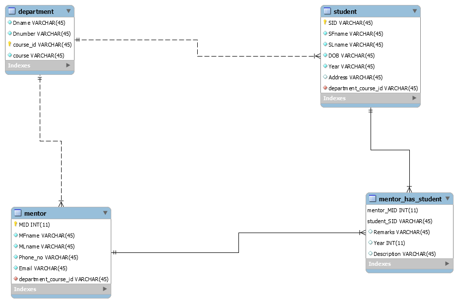

### 🗄️ Student-Mentor Relational Database System
<p align="center">
  <a href="https://github.com/asgeek96/Student-Mentor-Database">
    
  </a>
</p>
MySQL relational database managing 100 students, 12 mentors & 12 departments — designed to 3NF with full referential integrity  
**SQL:** DDL schema design, M:N junction table, 5-table JOINs, GROUP BY aggregations, grade-based filtering  
**Key Concept:** M:N mentor-student relationship resolved via `mentor_has_student` junction table with composite primary key  
ER diagram (MySQL Workbench), normalization to 3NF, foreign key constraints across all 4 tables  

🔗 [View Project](https://github.com/asgeek96/Student-Mentor-Database) · 📖 [Read Case Study](https://github.com/asgeek96/Student-Mentor_Database/blob/58b4382881641886de3415bc147080feb0feaac5/docs/case-study.md)

---

## 📌 Project Overview

Academic institutions often struggle to track which mentor is assigned to which student, across which course and department. This system solves that by providing a clean, normalized relational database that:

- Tracks students and their department/course enrollments
- Manages mentor profiles and their departmental affiliations
- Records mentor-student assignments along with yearly remarks and performance descriptions
- Enforces referential integrity across all relationships

---

## 🗂️ Database Schema

The database `student_mentor` consists of **4 tables**:

### `department`
| Column    | Type        | Constraint  | Description                              |
|-----------|-------------|-------------|------------------------------------------|
| Dname     | VARCHAR(45) | NOT NULL    | Department name (e.g., Computer_Science) |
| Dnumber   | VARCHAR(10) | NOT NULL    | Department code (e.g., CS-1)             |
| Course_id | VARCHAR(10) | PRIMARY KEY | Unique course identifier (e.g., CS-101)  |
| Course    | VARCHAR(45) | NOT NULL    | Course name (e.g., Cyber_Security)       |

### `student`
| Column               | Type         | Constraint  | Description                         |
|----------------------|--------------|-------------|-------------------------------------|
| SID                  | INT(11)      | PRIMARY KEY | Unique student identifier           |
| SFname               | VARCHAR(45)  | NOT NULL    | First name                          |
| SLname               | VARCHAR(45)  | NOT NULL    | Last name                           |
| DOB                  | DATE         | NOT NULL    | Date of birth (YYYY-MM-DD)          |
| Year                 | INT(4)       | NOT NULL    | Enrollment year                     |
| Address              | VARCHAR(100) | NOT NULL    | City of residence                   |
| Department_Course_id | VARCHAR(10)  | FOREIGN KEY | References department(Course_id)    |

### `mentor`
| Column               | Type         | Constraint  | Description                         |
|----------------------|--------------|-------------|-------------------------------------|
| MID                  | INT(11)      | PRIMARY KEY | Unique mentor identifier            |
| MFname               | VARCHAR(45)  | NOT NULL    | First name                          |
| MLname               | VARCHAR(45)  | NOT NULL    | Last name                           |
| Phone_no             | VARCHAR(15)  | NOT NULL    | Contact number                      |
| Email                | VARCHAR(100) | NOT NULL    | Institutional email address         |
| Department_Course_id | VARCHAR(10)  | FOREIGN KEY | References department(Course_id)    |

### `mentor_has_student` *(Junction Table)*
| Column      | Type         | Constraint       | Description                        |
|-------------|--------------|------------------|------------------------------------|
| Mentor_MID  | INT(11)      | FOREIGN KEY (PK) | References mentor(MID)             |
| Student_SID | INT(11)      | FOREIGN KEY (PK) | References student(SID)            |
| Remarks     | VARCHAR(10)  | NOT NULL         | Academic grade (e.g., A++, B+, F-) |
| Year        | INT(4)       | NOT NULL         | Year of mentorship                 |
| Description | VARCHAR(100) | NULL             | Additional notes on performance    |

---

## 🔗 Entity-Relationship Diagram



**Key Relationships:**
- A **Department** offers one or more courses (`1:N`)
- A **Student** belongs to one Department/Course (`N:1`)
- A **Mentor** belongs to one Department/Course (`N:1`)
- A **Mentor** can have many **Students**, and a Student can have many Mentors (`M:N`) — resolved via the `mentor_has_student` junction table

---

## 🛠️ Tech Stack

| Tool            | Purpose                        |
|-----------------|-------------------------------|
| MySQL 8.0+      | Relational database engine     |
| MySQL Workbench | Schema design & ER diagram     |
| CSV             | Sample data files              |

---

## 🚀 Setup & Usage

### Prerequisites
- MySQL Server installed
- MySQL Workbench (optional, for visual management)

### Step 1: Create the schema
```bash
mysql -u root -p < sql/schema.sql
```

### Step 2: Load the data
```bash
mysql -u root -p < sql/insert_data.sql
```

### Step 3: Run sample queries
```bash
mysql -u root -p < sql/queries.sql
```

---

## 📊 Sample Queries

### 1. List all students with their department and course
```sql
SELECT
    s.SID,
    CONCAT(s.SFname, ' ', s.SLname) AS Student_Name,
    d.Dname AS Department,
    d.Course AS Course
FROM student s
JOIN department d ON s.Department_Course_id = d.Course_id;
```

### 2. Find all students assigned to a specific mentor
```sql
SELECT
    CONCAT(s.SFname, ' ', s.SLname) AS Student_Name,
    ms.Remarks, ms.Year, ms.Description
FROM mentor_has_student ms
JOIN student s ON ms.Student_SID = s.SID
WHERE ms.Mentor_MID = 9;
```

### 3. Count how many students each mentor handles
```sql
SELECT
    CONCAT(m.MFname, ' ', m.MLname) AS Mentor_Name,
    COUNT(ms.Student_SID) AS Total_Students
FROM mentor m
LEFT JOIN mentor_has_student ms ON m.MID = ms.Mentor_MID
GROUP BY m.MID
ORDER BY Total_Students DESC;
```

### 4. Top-performing students (grade A++)
```sql
SELECT
    CONCAT(s.SFname, ' ', s.SLname) AS Student_Name,
    d.Course, ms.Remarks, ms.Year
FROM student s
JOIN mentor_has_student ms ON s.SID = ms.Student_SID
JOIN department d ON s.Department_Course_id = d.Course_id
WHERE ms.Remarks = 'A++';
```

### 5. Full assignment report
```sql
SELECT
    CONCAT(m.MFname, ' ', m.MLname) AS Mentor,
    CONCAT(s.SFname, ' ', s.SLname) AS Student,
    d.Dname AS Department,
    ms.Remarks, ms.Year, ms.Description
FROM mentor_has_student ms
JOIN mentor m     ON ms.Mentor_MID  = m.MID
JOIN student s    ON ms.Student_SID = s.SID
JOIN department d ON s.Department_Course_id = d.Course_id
ORDER BY ms.Year;
```

---

## 📁 Repository Structure

```
Student-Mentor-Database/
├── README.md                   ← Project documentation (this file)
├── ERDiagram.png               ← Entity-Relationship Diagram
├── sql/
│   ├── schema.sql              ← CREATE DATABASE + CREATE TABLE statements
│   ├── insert_data.sql         ← All INSERT INTO statements
│   └── queries.sql             ← Sample SELECT queries
├── data/
│   ├── Department.csv          ← 12 department/course records
│   ├── Mentor.csv              ← 12 mentor records
│   ├── Student.csv             ← 100 student records
│   └── mentor_has_Student.csv  ← 100 mentor-student assignment records
└── docs/
    └── Initial_entities.docx   ← Full design document with schema & SQL
```

---

## 💡 Key Concepts Demonstrated

- **Relational Schema Design** — Entities, attributes, and relationships modelled from scratch
- **Normalization (3NF)** — Tables designed to eliminate redundancy and transitive dependencies
- **Primary & Foreign Keys** — Referential integrity enforced across all 4 tables
- **Junction Table** — M:N relationship between Mentor and Student resolved via `mentor_has_student`
- **ER Diagram** — Visual representation of the schema using MySQL Workbench
- **SQL DDL & DML** — `CREATE TABLE`, `INSERT INTO`, `SELECT` with `JOIN`, `GROUP BY`, `WHERE`, subqueries

---

## 👤 Author

**Asgeek96**  
[GitHub Profile](https://github.com/asgeek96)
